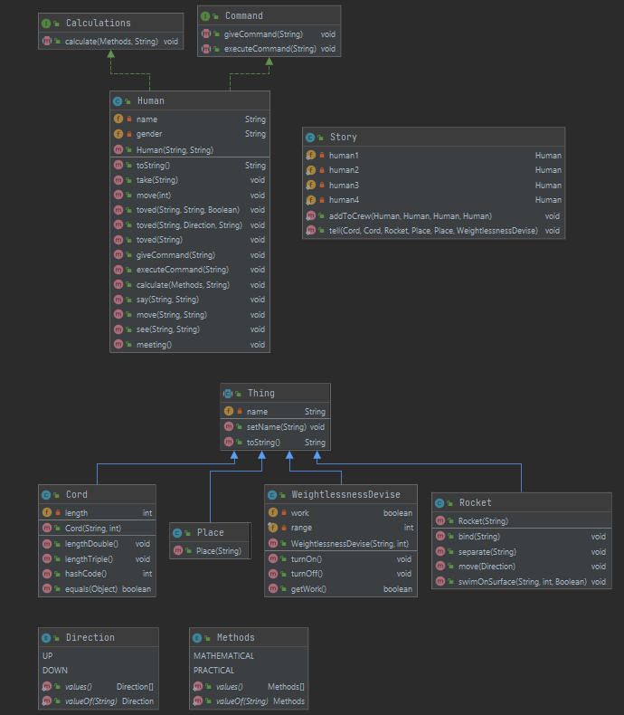
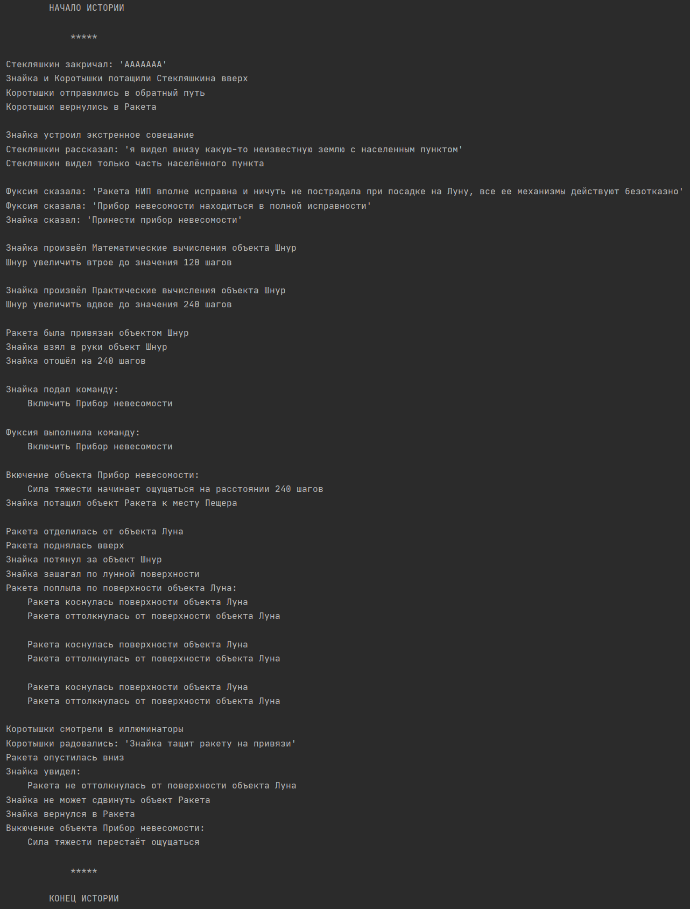

# Текст задания
> От радости они готовы были броситься друг другу в объятья, но не могли выпустить из рук веревку. А Стекляшкин уже кричал: Знайка и его друзья потащили Стекляшкина вверх. Скоро путешественники снова были все вместе и отправились в обратный путь. Как только они вернулись в ракету, Знайка устроил экстренное совещание. Стекляшкин рассказал, что он видел внизу какую-то неизвестную землю с населенным пунктом. Возможно, это был большой лунный город, но, может быть, и небольшой поселок. Этого Стекляшкин не мог точно сказать, так как видел лишь часть населенного пункта в разрывах облаков. Фуксия рассказала, что ракета НИП вполне исправна и ничуть не пострадала при посадке на Луну, все ее механизмы действуют безотказно. Что касается прибора невесомости, то он также находится в полной исправности. Знайка велел принести прибор невесомости и сказал: Он тут же принялся производить математические вычисления, которые показали, что шнур должен быть длиннее втрое, то есть около ста двадцати шагов. Когда же стали производить практическую проверку, то оказалось, что и эту цифру пришлось увеличить еще в два раза. При включении прибора невесомости силу тяжести можно было ощущать, только находясь примерно в двухстах сорока шагах от ракеты. Наконец практическая проверка расчетов была закончена. К ракете привязали длинный капроновый шнур, и Знайка пожелал лично отбуксировать ее к пещере. Взяв в руки конец шнура и отойдя от ракеты на двести сорок шагов, он подал по радиотелефону команду включить прибор невесомости. Фуксия тотчас включила прибор. Потеряв вес, ракета медленно отделилась от поверхности Луны и поднялась вверх. Как известно, все предметы, теряя вес, обычно поднимаются вверх (если они, конечно, не закреплены). Ведь, находясь под действием силы тяжести, каждый предмет как бы сжимается или сплющивается хотя бы на самую ничтожную величину. Но как только предмет потеряет вес, он разжимается, выпрямляется, в результате чего отталкивается, как пружина, от поверхности, на которой до этого неподвижно стоял. Заметив, что ракета поднялась на достаточную высоту, Знайка потихонечку потянул за шнур и не спеша зашагал по лунной дорожке. Ракета приняла горизонтальное положение и послушно поплыла над поверхностью Луны. Правда, по временам она опускалась, но, едва коснувшись поверхности Луны, отталкивалась от нее и снова поднималась вверх. Коротышки, сидевшие внутри ракеты, смотрели в иллюминаторы. Все радовались, видя, как Знайка, совершенно без каких бы то ни было усилий, тащит огромную ракету на привязи. Все же радость их была преждевременна. Знайка уже был недалеко от пещеры и считал свою задачу выполненной, но в это время ракета снова опустилась вниз. На этот раз Знайка увидел, что она не оттолкнулась от поверхности Луны, и почувствовал, что ему стало трудно ее тащить, а через несколько шагов он и вовсе не мог сдвинуть ее с места. Убедившись, что усилия его напрасны, Знайка решил, что коротышки, оставшиеся в ракете, задумали над ним подшутить, и закричал сердито: Знайка быстро вернулся в ракету и принялся проверять прибор невесомости, но сколько он ни включал его, сколько ни выключал, невесомость не появлялась.

# UML диаграмма

# Пример вывода программы

